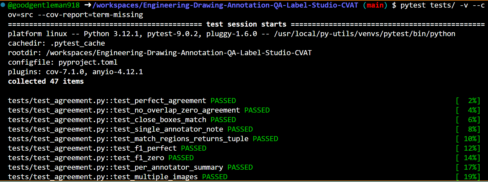
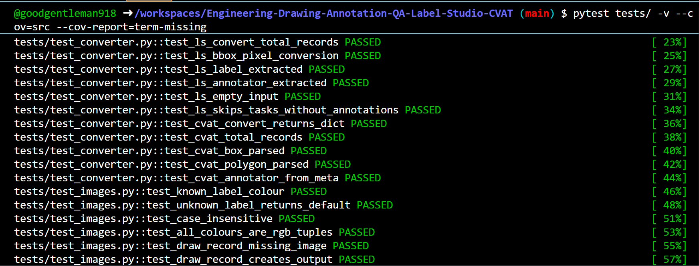
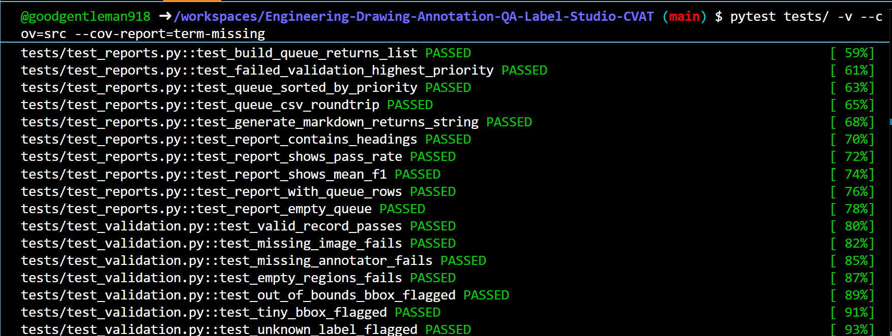
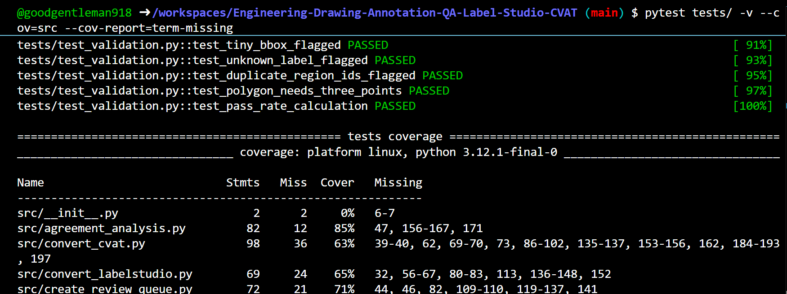
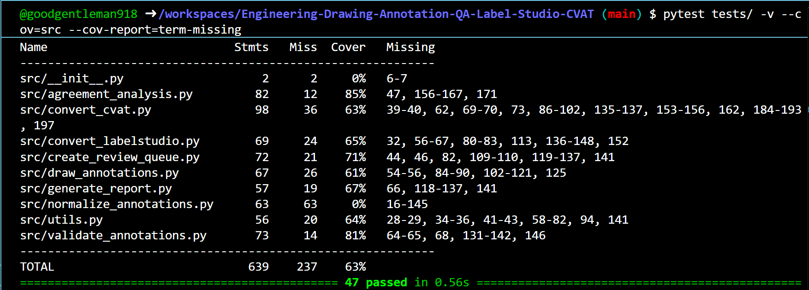

# Engineering Drawing Annotation QA

[](https://python.org)
[](LICENSE)

A lightweight, **zero-heavy-dependency** Python pipeline for converting, validating, and quality-assuring annotations on engineering drawings exported from **Label Studio** and **CVAT**.

---

## ⚠️ Before You Run

**The pipeline requires your engineering drawing images to be present in `data/drawings/`.**
It will refuse to run and display a clear error if that folder is missing or empty.

```
ERROR: No drawing images found in: data/drawings/
  The pipeline requires at least one image file (.png, .jpg, .tif, .tiff).
  Add your engineering drawings to that folder and re-run.
  See README.md -> 'Adding Your Own Drawings' for details.
```

See [Adding Your Own Drawings](#adding-your-own-drawings) below.

---

## What It Does

| Step | Script | Input | Output |
|---|---|---|---|
| 1. Convert Label Studio | `convert_labelstudio.py` | LS JSON export | Normalized JSON |
| 2. Convert CVAT | `convert_cvat.py` | CVAT XML export | Normalized JSON |
| 3. Merge & Normalize | `normalize_annotations.py` | Any of the above | Unified JSON |
| 4. Validate | `validate_annotations.py` | Normalized JSON | `validation_report.json` |
| 5. Agreement Analysis | `agreement_analysis.py` | Normalized JSON | `agreement_summary.json` |
| 6. Review Queue | `create_review_queue.py` | Reports | `review_queue.csv` |
| 7. Report | `generate_report.py` | Reports + queue | `annotation_report.md` |
| 8. Visualise | `draw_annotations.py` | Normalized JSON + images | Annotated PNGs |

---

## Repository Structure

```
Engineering-Drawing-Annotation-QA/
│
├── data/
│   ├── drawings/                      # ← Your engineering drawing images go here
│   │   ├── air_compressor_001.png     #   (pipeline will not run without these)
│   │   ├── bearing_001.jpg
│   │   ├── electrical_panel_001.jpg
│   │   ├── gearbox_001.jpg
│   │   ├── heat_exchanger_001.jpg
│   │   ├── motor_001.jpg
│   │   ├── pipline_001.jpg
│   │   ├── pump_001.png
│   │   └── valve_001.jpg
│   ├── exports/
│   │   ├── labelstudio/
│   │   │   └── engineering_annotations.json   # Label Studio JSON export
│   │   └── cvat/
│   │       ├── air_compressor_001.xml
│   │       ├── bearing_001.xml
│   │       ├── electrical_panel_001.xml
│   │       ├── gearbox_001.xml
│   │       ├── heat_exchanger_001.xml
│   │       ├── motor_001.xml
│   │       ├── pipeline_001.xml
│   │       ├── pump_001.xml
│   │       └── valve_001.xml
│   └── normalized/
│       └── annotations.json                   # Merged normalized output
│
├── outputs/
│   └── review_images/                 # Annotated images written by draw_annotations.py
│
├── reports/
│   ├── validation_report.json         # Per-record validation results
│   ├── agreement_summary.json         # Inter-annotator F1 scores
│   ├── review_queue.csv               # Prioritised images for review
│   └── annotation_report.md           # Full Markdown QA report
│
├── scripts/
│   ├── run_pipeline.ps1               # Windows (PowerShell)
│   └── run_pipeline.sh                # macOS / Linux (Bash)
│
├── src/
│   ├── convert_labelstudio.py
│   ├── convert_cvat.py
│   ├── normalize_annotations.py
│   ├── validate_annotations.py
│   ├── agreement_analysis.py
│   ├── create_review_queue.py
│   ├── generate_report.py
│   ├── draw_annotations.py
│   ├── utils.py
│   └── __init__.py
│
├── tests/
│   ├── test_converter.py
│   ├── test_validation.py
│   ├── test_agreement.py
│   ├── test_reports.py
│   └── test_images.py
│
├── .gitignore
├── LICENSE
├── README.md
├── requirements.txt
└── pyproject.toml
```

---

## Annotation Classes

The following labels are recognised by the pipeline and match the actual CVAT annotation labels used in this project:

| Class | Description |
|---|---|
| `pump` | Centrifugal, gear, or positive displacement pumps |
| `valve` | Gate, ball, check, control valves |
| `motor` | Electric motors |
| `pipeline` | Pipeline runs |
| `bearing` | Bearings and bearing housings |
| `gearbox` | Gearboxes and gear assemblies |
| `air_compressor` | Air compressors |
| `electrical_panel` | Electrical panels and switchgear |
| `heat_exchanger` | Heat exchangers |

---

## Adding Your Own Drawings

> **The pipeline will not run without drawings.** This is intentional — running without images produces meaningless output.

**Step 1 — Add your drawings:**

```
data/drawings/
    your_drawing_001.png
    your_drawing_002.png
    ...
```

Accepted formats: `.png` `.jpg` `.jpeg` `.tif` `.tiff` `.bmp`

**Step 2 — Annotate them in CVAT or Label Studio using Docker, then export:**

| Tool | How to export | Save to |
|---|---|---|
| **CVAT** | Actions → Export dataset → **CVAT for Images 1.1** (XML) | `data/exports/cvat/<drawing_name>.xml` |
| **Label Studio** | Project → Export → **JSON** | `data/exports/labelstudio/engineering_annotations.json` |

Supported CVAT annotation types: `<box>`, `<polygon>`, `<polyline>`

> The filename inside the annotation export (e.g. `"image": "your_drawing_001.png"`) must exactly match the filename in `data/drawings/`.

### CVAT Annotation using Docker

**Windows (PowerShell):**

Verify Docker

docker --version

docker compose version

Test:

docker run hello-world

You should see

Hello from Docker!

Install CVAT Community Edition (https://github.com/cvat-ai/cvat)

Clone CVAT

git clone https://github.com/cvat-ai/cvat.git

cd cvat

Start CVAT

docker compose up -d

First launch downloads several Docker images, so it can take 10–20 minutes

Check containers

docker ps

Create administrator

docker exec -it cvat_server bash

python3 ~/manage.py createsuperuser

Username - your username

Email -    your email

Open - http://localhost:8080

Enter username & password

Superuser created successfully for drawings/image annotation

Exit

exit

### Label Studio Annotation using Docker

**Windows (PowerShell):**

docker run -it `

-p 8081:8080 `

-v ${PWD}/data:/label-studio/data `

heartexlabs/label-studio:latest

Visit

http://localhost:8081

Create your account for image/drawings annotation

### This repository only used CVAT Annotation using Docker while building

---

## Quick Start

### Requirements

- Python 3.10+
- No mandatory external libraries — the full pipeline uses only the Python standard library
- `Pillow` is optional (only for `draw_annotations.py`)

### 1. Clone & install

```bash
git clone https://github.com/Enterprise-AI-Soutions/Engineering-Drawing-Annotation-QA-Label-Studio-CVAT.git
cd Engineering-Drawing-Annotation-QA
```
```
pip install -r requirements.txt
```

### 2. Add your drawings and annotation exports

See [Adding Your Own Drawings](#adding-your-own-drawings) above.

### 3. Run the full pipeline

**Windows (PowerShell):**

```powershell
.\scripts\run_pipeline.ps1
```

**macOS / Linux /VSCode:**

```bash
chmod +x scripts/run_pipeline.sh
scripts/run_pipeline.sh
```

### 4. Run individual steps

**Convert Label Studio export:**

```bash
python src/convert_labelstudio.py `
    --input  data/exports/labelstudio/engineering_annotations.json `
    --output data/normalized/annotations.json
```

**Convert a CVAT XML export:**

```bash
python src/convert_cvat.py `
    --input  data/exports/cvat/pump_001.xml `
    --output data/normalized/annotations.json
```

**Merge multiple sources:**

```bash
python src/normalize_annotations.py `
    --inputs data/exports/labelstudio/engineering_annotations.json `
             data/exports/cvat/pump_001.xml `
    --output data/normalized/annotations.json
```

**Validate:**

```bash
python src/validate_annotations.py `
    --input  data/normalized/annotations.json `
    --output reports/validation_report.json
```

**Inter-annotator agreement:**

```bash
python src/agreement_analysis.py `
    --input  data/normalized/annotations.json `
    --output reports/agreement_summary.json
```

**Build review queue:**

```bash
python src/create_review_queue.py `
    --validation reports/validation_report.json `
    --agreement  reports/agreement_summary.json `
    --output     reports/review_queue.csv
```

**Generate full report:**

```bash
python src/generate_report.py `
    --validation reports/validation_report.json `
    --agreement  reports/agreement_summary.json `
    --queue      reports/review_queue.csv `
    --output     reports/annotation_report.md
```

**Draw annotations on images (requires Pillow):**

```bash
python src/draw_annotations.py `
    --annotations data/normalized/annotations.json `
    --drawings    data/drawings `
    --output      outputs/review_images
```

---

## Running Tests

```bash
pytest tests/ -v
```

With coverage:

```bash
pytest tests/ -v --cov=src --cov-report=term-missing
```

---

## Normalized Annotation Format

```json
{
  "schema_version": "1.0",
  "source": "merged",
  "total_records": 10,
  "annotations": [
    {
      "id": "ann_cvat_pump001",
      "image": "pump_001.png",
      "annotator": "goodgentleman918@gmail.com",
      "source": "cvat",
      "image_width": 2500,
      "image_height": 2500,
      "regions": [
        {
          "id": "cvat_r001",
          "label": "pump",
          "type": "polyline",
          "polyline": [[422,376],[2351,789]],
          "confidence": 1.0
        }
      ]
    }
  ]
}
```

Supported region types: `bbox`, `polygon`, `polyline`

---

## Supported Export Formats

| Tool | Format | Annotation types |
|---|---|---|
| **Label Studio** | JSON | `rectanglelabels` → bbox, `polygonlabels` → polygon |
| **CVAT** | XML (v1.1) | `<box>` → bbox, `<polygon>` → polygon, `<polyline>` → polyline |

---
### Pytest Outputs












## License

MIT — see [LICENSE](LICENSE)
